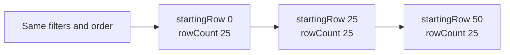

Large searches are easier to consume in bounded pages. The shared search implementation now applies `startingRow` and `rowCount` to ordinary search queries, allowing an integration to request a portion of the results instead of processing the full set at once.

## Request an ordered page

`startingRow` is a zero-based offset: `0` starts with the first row. `rowCount` specifies how many rows to request. For example, this [`TripSearch`]({{ '/api/TripSearch.html' | relative_url }}) parameter object requests up to 25 rows after skipping the first 10, ordered by trip record number:

```json
{
  "startingRow": 10,
  "rowCount": 25,
  "includeColsExtended": [
    { "name": "recNo", "sortDirection": 1, "sortIndex": 1 },
    { "name": "name" }
  ]
}
```

The server translates that window into `OFFSET 10 ROWS FETCH NEXT 25 ROWS ONLY`. For consecutive pages of 25 rows, use offsets `0`, `25`, `50`, and so on while keeping the filters and ordering consistent.



Use a stable ordering, with a unique tie-breaker when sorting on a non-unique field such as a name. Offset paging does not provide a snapshot: inserts, deletions, or changes between requests can shift later pages. Applications that need a consistent export must account for changes during retrieval.

## Choose one limiting approach

A positive `topRows` takes precedence over `startingRow` and `rowCount` in the shared limit plan. Omit it when requesting consecutive pages.

A missing or zero `rowCount` does not request an empty page; it leaves that row-count limit unset. Supply a positive value when the goal is bounded retrieval.

Report mode (`reportFormat: true`) bypasses offset paging. Aggregate and grouped queries also have different limit behavior. A page of source rows is not interchangeable with a page of report totals, so validate those workflows separately rather than reusing a table-pagination loop unchanged.

## Check your integration

Begin with a small, unchanged result set. Confirm that adjacent pages do not overlap, that the final short page is handled, and that an offset beyond the result set returns no rows. Keep column selection narrow so each page contains the data the caller actually needs.
