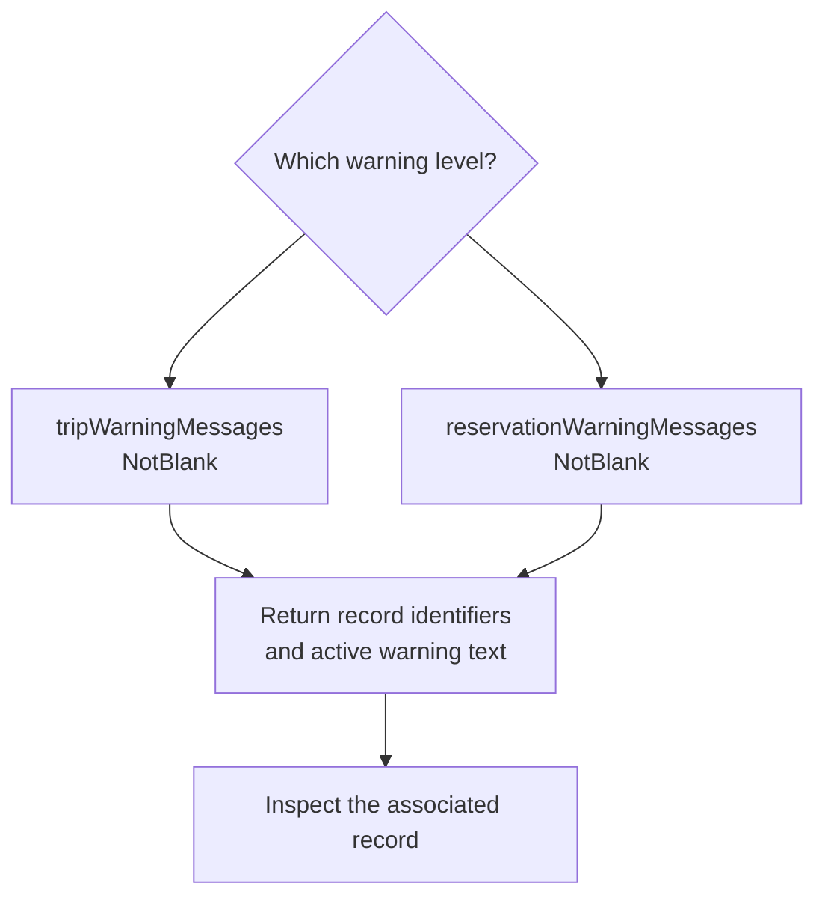

A list of imported trips is more useful when it can show which records need attention. [`TripSearch`]({{ '/api/TripSearch.html' | relative_url }}) provides warning-message columns and matching filters at both trip and reservation level.

## Choose the warning level

| Field and filter | Meaning |
| --- | --- |
| `tripWarningMessages` | Warning messages belonging to the trip. |
| `reservationWarningMessages` | Warning messages belonging to the reservation. |

The warning text includes messages that have not been hidden or dismissed. These columns are an active-warning view, not a complete history of every warning ever raised.

To find trips with a nonblank trip-warning field, use the `NotBlank` condition from [`StringCompare`]({{ '/api/StringCompare.html' | relative_url }}):

```json
{
  "tripWarningMessages": { "compareCondition": 4 },
  "includeCols": ["recNo", "name", "tripWarningMessages"]
}
```

For reservation warnings, use a separate request with `reservationWarningMessages` as the filter and result column. A trip with no trip-level warnings may still have a reservation warning, so one request should not be assumed to cover both levels.



## Display enough context to act

Keep the trip identifier and name beside the message. When presenting reservation warnings, include the reservation identifiers your workflow needs to open the correct record. Multiple warning messages can be combined in the text field; do not assume one result field represents one warning.

Text comparison operators can narrow a search to a known phrase. Treat that as a text search, rather than relying on human-readable wording as a permanent machine-readable error code.

## Verify the list's meaning

Check a trip with an active warning, one with only a reservation warning, and one whose warning has been dismissed. Confirm that your UI distinguishes those cases. An empty active-warning field means there is no matching visible warning text; it is not proof that the trip has passed every business validation.
