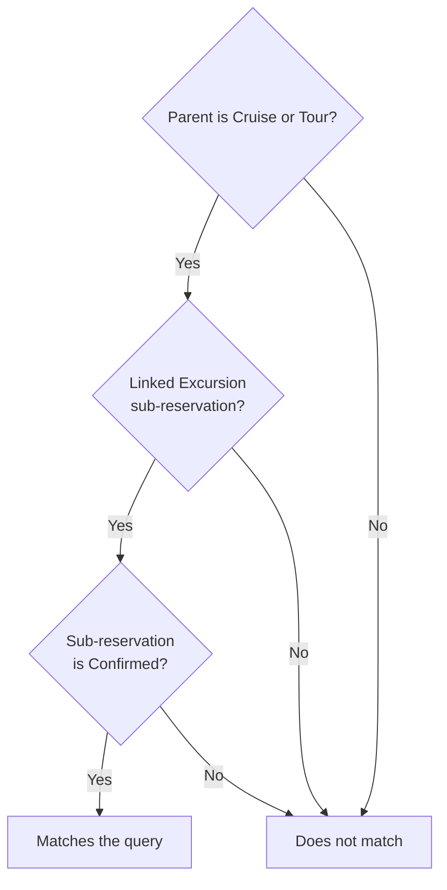

A trip can contain several kinds of reservation, and a reservation can contain its own sub-reservations. Finding a cruise with an excursion requires a relationship-aware filter: the excursion must belong to the matching parent reservation.

[`TripSearch`]({{ '/api/TripSearch.html' | relative_url }}) supports `subReservationTravelCategory` and `subReservationStatus` alongside the parent `reservationTravelCategory` filter.

## Require a matching parent and child

This parameter object selects Cruise or Tour parents with a linked Confirmed Excursion sub-reservation:

```json
{
  "reservationTravelCategory": {
    "compareCondition": 1,
    "value": [4, 5]
  },
  "subReservationTravelCategory": {
    "compareCondition": 1,
    "value": [10]
  },
  "subReservationStatus": {
    "compareCondition": 1,
    "value": [2]
  },
  "includeCols": ["recNo", "name"]
}
```

The travel-category values are Cruise `4`, Tour `5`, and Excursion `10`. Confirmed status is `2`. The comparisons use condition `1` with the listed enum values.



## Keep the relationship explicit

| Example | Matches this request? |
| --- | --- |
| Cruise with a confirmed excursion sub-reservation | Yes |
| Tour with a confirmed excursion sub-reservation | Yes |
| Air reservation with an excursion sub-reservation | No: parent category fails |
| Cruise with no excursion sub-reservation | No: child category fails |
| Cruise with only a pending excursion sub-reservation | No: child status fails |

Do not replace the linked-child condition with a search for any excursion elsewhere on the trip. That answers a different question.

Omit `subReservationStatus` when the request should not restrict child status. Omit the parent-category filter when the query should accept matching children under any parent category. Change these deliberately so the result still answers the intended business question.

The selected result columns determine what the search returns. Using a child filter does not, by itself, request a complete nested sub-reservation model. Load the associated trip or reservation through the appropriate workflow when you need more detail.
