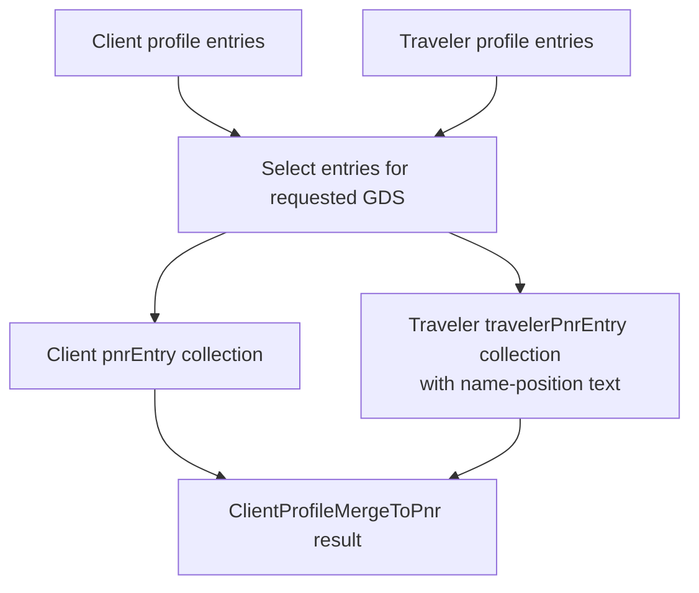

A client may need the same freeflow entry on successive bookings. A traveler may need a different entry associated with their name. Keeping those entries on the corresponding profiles gives an integration a reusable source for its merge-to-PNR workflow.

This walkthrough covers the profile-entry API and its merge result. Check the target environment’s API version before adopting these fields.

## Store the entry with its owner

[`ClientProfile`]({{ '/api/ClientProfile.html' | relative_url }}) exposes `clientProfilePnrEntryLink`. [`Person`]({{ '/api/Person.html' | relative_url }}) exposes `personPnrEntryLink`. Both link to a `pnrEntry` containing:

| Field | Purpose |
| --- | --- |
| `gdsType` | Identifies the GDS for the entry. |
| `description` | Describes the entry for the person maintaining it. |
| `value` | Holds the entry text. |
| `alwaysMove` | Carries the entry's move preference. |

The entry value is required and limited to 128 characters; the description allows 64. The shared schema lists Amadeus, Galileo, and Sabre identifiers. That list alone does not establish support for every merge path.

## Follow the merge result

The Amadeus and Galileo implementations select entries matching the requested GDS. Client entries appear in the merge result's `pnrEntry` collection. Traveler entries appear under each traveler's `travelerPnrEntry` collection, with GDS-specific name-position text appended to their values.

[`ClientProfileMergeToPnr`]({{ '/api/ClientProfileMergeToPnr.html' | relative_url }}) returns `value` and `alwaysMove` for both kinds of entry, plus the relevant client or traveler record number. Preserve that association when consuming the result. The presence of an entry in this model is not proof that a downstream GDS has accepted it.

## Integration checks

Use a small test profile with entries for two GDS types and confirm that the merge returns only the requested type. Add two travelers with different entries and check their name associations independently. Preserve `alwaysMove` for the consuming workflow instead of treating every returned entry as an unconditional command.
