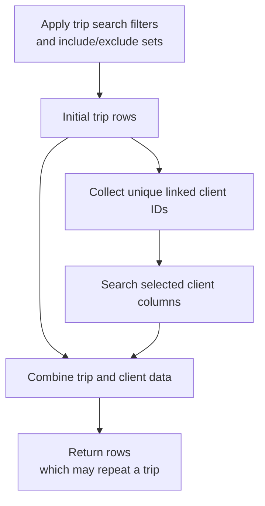

A trip search can answer more useful questions when its results include information from the linked client. Cross-area client columns let an integration request that information alongside trip data without treating the two areas as one undifferentiated record.

This walkthrough focuses on table-search results. Validate report aggregation and multiple-tag scenarios separately against the version your integration targets.

## Select the additional columns explicitly

[`TripSearch`]({{ '/api/TripSearch.html' | relative_url }}) supports extended column selection through `includeColsExtended`. The cross-area design adds client columns to that selection. They are not automatically included when the request omits a column list.

Use the column identifiers supplied by the matching server or client model. Keep client and trip columns distinguishable in your result handling, especially where both areas contain similarly named values.

## A returned row is not always a unique trip

The initial trip search determines the trip set. A separate search retrieves the selected data for the linked clients. If that search produces multiple rows for a client, combining the results can create more than one row for the same trip.

For example, imagine one trip whose linked client contributes two selected detail rows. The combined result may contain that trip twice, once for each detail row. This is an illustration of result shape, not a promise that every client column creates extra rows.

Count distinct trip identifiers when the question is “how many trips?” Do not blindly sum repeated trip-level values to calculate totals. Decide whether your output represents trips, client details, or a report aggregation before choosing a counting rule.

## Preserve the original boundaries

The table-search contract applies filters to the trip results; selecting linked client columns does not add an independent client-filter stage to the request. It also does not apply sorting to cross-area columns. Avoid inferring either capability merely because a client field appears in the result.
