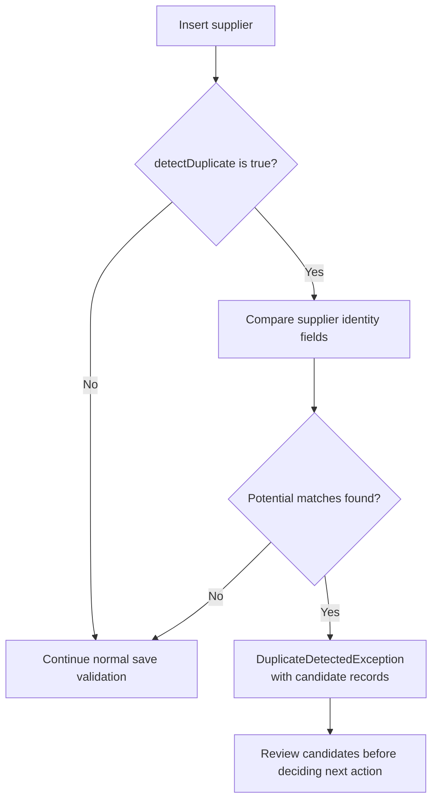

Small differences in a supplier's name or address can make an existing profile hard to recognize. Supplier duplicate detection lets an integration request a similarity check as part of creating a profile, then present potential matches before continuing.

## Request detection on insert

[`SupplierProfile`]({{ '/api/SupplierProfile.html' | relative_url }}) exposes the boolean `detectDuplicate` field. The server runs detection when the save action is an **insert** and the flag is explicitly `true`. It is not a general check that automatically runs on every update.

Include the flag in the supplier data you already save through your integration's normal model or delta workflow. It does not replace the other required supplier fields.

## Treat a match as a decision point

The implementation compares supplier identity information such as name, physical address, and primary contact information. Matching weights and the score threshold are configurable, so an integration should not treat one fixed score as a universal identity rule.

When candidates are found, the server raises `DuplicateDetectedException` carrying the candidate list. Handle that as a distinct result from an ordinary successful save. Present enough candidate information for the caller to identify an existing supplier or correct the proposed data.

Do not automatically retry with detection disabled: that would remove the decision point the caller requested. Likewise, similarity is not proof that two profiles should be merged. Choosing an existing profile, correcting the input, and deliberately creating a separate supplier are different actions.

## Check the save result

Exercise both paths with test data: a distinct supplier that passes normal validation, and a similar supplier that returns candidates. Confirm that your integration displays the candidate result without treating it as a successful creation.

The [August 6 refresh]({{ '/2026/08/06/api-docs-refresh-trip-remarks-and-pnr-links.html' | relative_url }}) lists the supplier reference alongside the other API changes.
